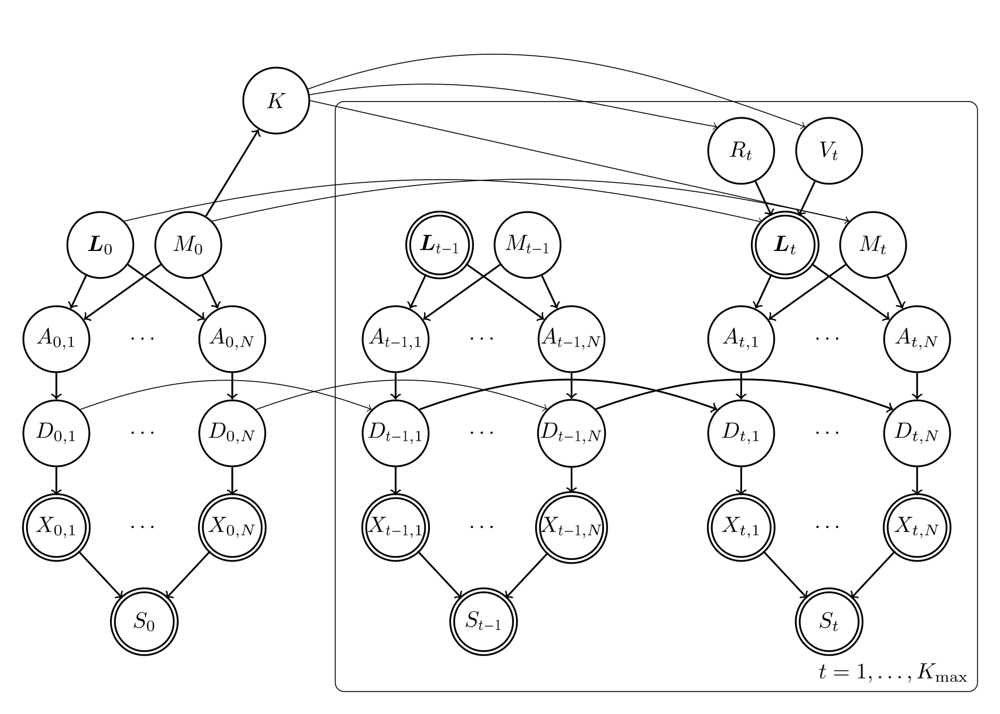
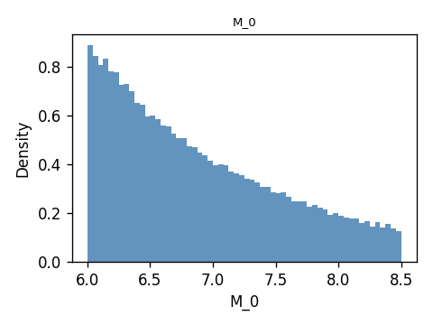
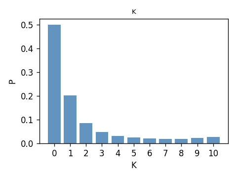
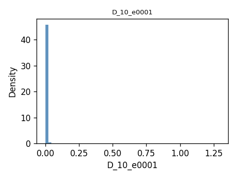
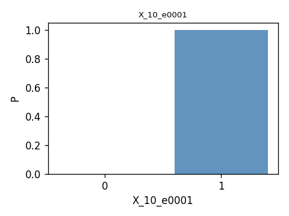
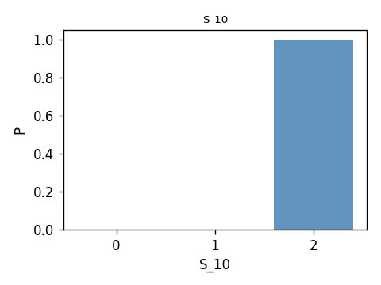

EMA aftershock example
======================

This example builds a Bayesian network for earthquake mainshock-aftershock
analysis on the Eastern Massachusetts highway network. It combines regional
seismicity, edge-level ground motion and damage, binary component survival, and
a system-state classifier based on RSR reference sets.

The full mathematical model is described in
:download:`EMA_aftershock_models.pdf <../../../examples/EMA_aftershock/data/EMA_aftershock_models.pdf>`.
The EMA benchmark network and the hypothetical areal seismic source zone are shown below:

.. image:: ../../../examples/EMA_aftershock/data/ema_network.png
   :alt: EMA highway network and seismic source zone
   :align: center
   :width: 650px

The main BN structure is:

At a high level, the model has one mainshock and up to ``K_max`` aftershock
slots. The mainshock has location ``L_0``, magnitude ``M_0``, and induced edge
variables ``A_{0,n}``, ``D_{0,n}``, and ``X_{0,n}``. The number of aftershocks
``K`` is sampled from ``M_0``. Each aftershock slot ``t`` has distance ``R_t``,
angle ``V_t``, location ``L_t``, magnitude ``M_t``, and the same edge-level
sequence ``A_{t,n}``, ``D_{t,n}``, and ``X_{t,n}``. The system state ``S_t`` is
computed from all component states ``X_{t,n}``.

The example workflow has three analysis steps:

1. Define the BN variables and probability objects.
2. Run unconditional forward sampling and summarise prior behaviour.
3. Estimate ``P(S_t | X_{0,n}=0)`` by modifying a damage node ``P(D_{0,n} | A_{0,n})``.

Step 1: define the model
------------------------

The file ``examples/EMA_aftershock/s01_define_model.py`` assembles the BN.
It provides helper functions to load the highway topology, load RSR reference
sets, create variables, and attach each variable to its probability object.

The main inputs are:

- ``data/nodes.json`` and ``data/edges.json`` for the EMA highway topology.
- ``data/probs_eq.json`` for edge-level single-shock survival/failure data.
- ``rsr_res/refs_up_*.pt`` and ``rsr_res/refs_low_*.pt`` for system-state
  classification.

The key construction functions are:

- ``load_topology()`` reads nodes and edges and computes edge midpoints.
- ``load_rsr_refs()`` loads the reference tensors used by ``S_t``.
- ``define_variables()`` creates names such as ``L_x_0``, ``M_0``, ``K``,
  ``A_0_e0001``, ``D_0_e0001``, ``X_0_e0001``, and ``S_0``.
- ``define_probs()`` creates the corresponding probability objects from
  ``l.py``, ``m.py``, ``k.py``, ``r.py``, ``v.py``, ``a.py``, ``d.py``,
  ``x.py``, and ``s.py``.

The model separates ``L_x`` and ``L_y`` into different variables because the
inference engine expects each probability object to own a unique child
variable name. Mainshock location coordinates are independent uniforms, while
aftershock coordinates are deterministic functions of ``L_0``, ``R_t``, and
``V_t``.

.. literalinclude:: ../../../examples/EMA_aftershock/s01_define_model.py
   :language: python
   :linenos:

Step 2: forward inference
-------------------------

The file ``examples/EMA_aftershock/s02_forward_inference.py`` performs prior
forward inference with no evidence. It builds the full BN using
``s01_define_model.py`` and samples every variable:

.. code-block:: python

   filled = inference.sample(
       probs=probs,
       query_nodes=query_nodes,
       n_sample=n_sample,
       batch_size=50_000,
   )

The ``batch_size`` argument controls how many samples are generated at once, so that a large number of samples can be generated without running out of memory.

The script writes two kinds of output:

- ``results/forward_stats_Kmax{K}_maxst{M}_n{N}.csv`` with long-form summary
  statistics.
- ``results/histograms/Kmax{K}_maxst{M}_n{N}/`` with one histogram PNG per
  variable.

Representative prior histograms are shown below.

Run the script from the example directory:

.. code-block:: bash

   cd examples/EMA_aftershock
   python s02_forward_inference.py

Step 3: conditioning on component failure
-----------------------------------------

The file ``examples/EMA_aftershock/s03_cal_s_x0.py`` estimates

.. math::

   P(S_t \mid X_{0,n}=0)

for each edge ``n`` and each time slice ``t``. Here ``X_{0,n}=1`` means that
edge ``n`` survives the mainshock, so ``X_{0,n}=0`` means the edge fails.

The conditioning is implemented by a small model surgery. Since ``X_{0,n}``
is a deterministic threshold of ``D_{0,n}``, the script replaces the original
probability object for ``D_{0,n}`` with ``DeltaD``:

.. code-block:: python

   probs_mod[f"D_0_{edge_id}"] = DeltaD(
       childs=[varis[f"D_0_{edge_id}"]],
       parents=orig.parents,
       value=1.0,
       device=device,
   )

This sets ``D_{0,n}=1.0`` regardless of the values of its parent variables.
Because ``1.0`` is above the damage threshold used by ``X_{0,n}``, the
modified BN represents the event ``X_{0,n}=0``. Forward sampling under this
modified model therefore gives Monte Carlo samples from
``P(S_t | X_{0,n}=0)``:

.. code-block:: python

   marg = estimate_S_marginals(
            probs_mod,
            varis,
            K_max,
            n_sample,
            max_st=max_st,
            batch_size=batch_size,
        )

where ``estimate_S_marginals()`` is a helper function that runs forward sampling using ``inference.sample`` with the updated probabilities ``probs_mod``.

The surrogate node keeps the original parents so that ancestor ordering and
downstream dependencies remain valid, but its ``sample`` and ``log_prob``
methods ignore those parent values.

The output is a long-form CSV:

``results/S_given_X0_zero_Kmax{K}_maxst{M}_n{N}.csv``

with columns:

- ``edge``
- ``t``
- ``S``
- ``P(S_t=S | X_0_n=0)``
- ``cov``, the coefficient of variation of the empirical probability estimate

Run the script from the example directory:

.. code-block:: bash

   cd examples/EMA_aftershock
   python s03_cal_s_x0.py

The ``__main__`` block can be adjusted for larger or smaller sample budgets,
GPU use, and a subset of target edges.
